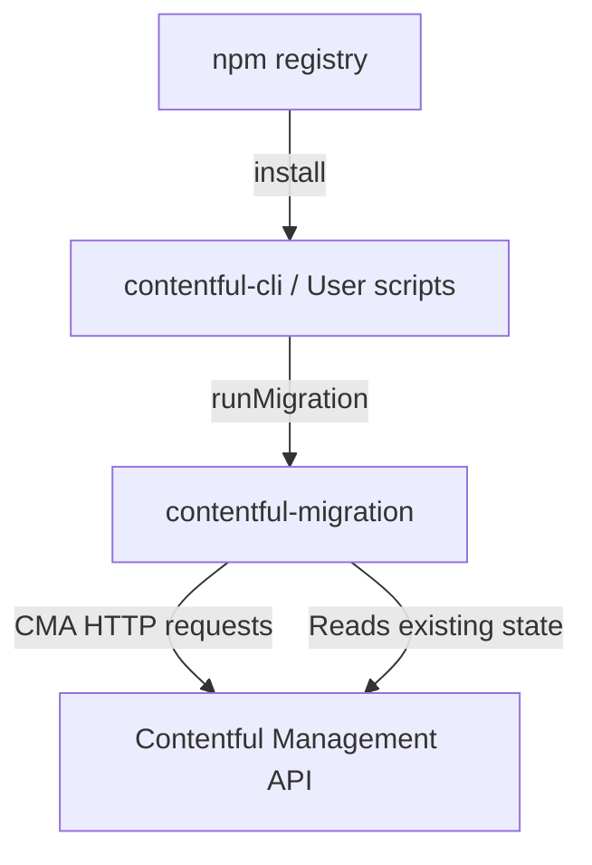
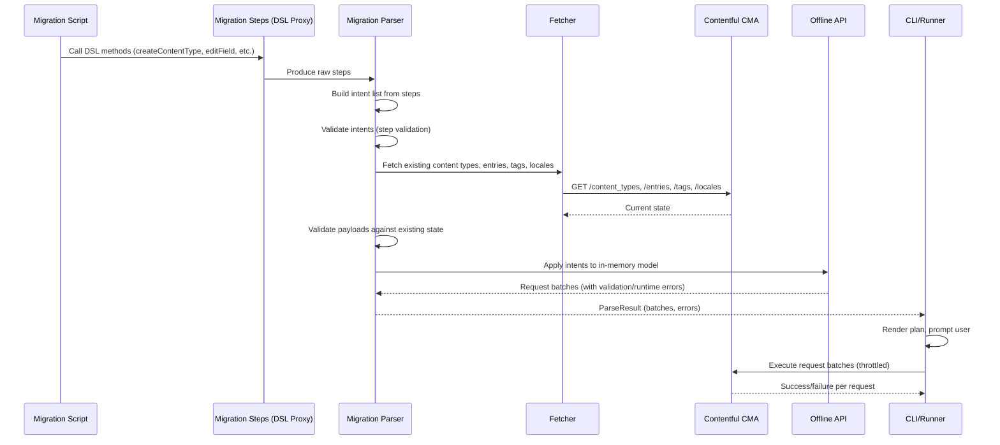

# Architecture

<!-- Generated by seed-golden-context | Last updated: 2026-05-05 -->

## Overview

`contentful-migration` is a TypeScript library and DSL for scripting content model and content entry migrations against the Contentful Management API (CMA). It parses user-defined migration scripts, builds an execution plan with validation, and applies changes as batched API requests. The standalone CLI entry point is retained for direct usage, but the primary CLI experience is provided by `contentful-cli`'s `space migration` command which wraps this library.

## System Context

**Upstream consumers:**
- `contentful-cli` — wraps this library as its `space migration` command
- User Node.js scripts — call `runMigration()` directly
- CI pipelines — run migration scripts as part of deployment flows

**Downstream dependencies:**
- Contentful Management API (CMA) — the sole external service; all mutations go here
- `contentful-management` npm package — the JS SDK used for HTTP communication

## Internal Structure

| Directory | Purpose |
|---|---|
| `src/index.ts` | Library entry point; re-exports `runMigration` |
| `src/bin/cli.ts` | CLI execution engine; orchestrates parsing, validation, plan rendering, and request execution |
| `src/bin/usage-params.ts` | Yargs CLI argument definitions |
| `src/bin/lib/config.ts` | Configuration resolution (file `.contentfulrc.json`, env vars, CLI args) |
| `src/bin/lib/contentful-client/` | CMA client creation with proxy support |
| `src/bin/lib/render-migration.ts` | Plan and error rendering for terminal output |
| `src/lib/migration-parser.ts` | Core orchestrator: builds intents from user script, validates, fetches existing state, produces request batches |
| `src/lib/migration-steps/` | DSL proxy layer; intercepts method calls on migration/content-type/field objects to produce raw steps |
| `src/lib/intent/` | Intent classes representing each discrete migration operation (create CT, update field, transform entries, etc.) |
| `src/lib/intent-list/` | Manages ordered list of intents, applies validators, supports compression |
| `src/lib/intent-validator/` | Validates intents against existing content model state |
| `src/lib/action/` | Action classes that convert intents into CMA API request payloads |
| `src/lib/entities/` | Domain model classes: `ContentType`, `Entry`, `Tag`, `Link` |
| `src/lib/offline-api/` | In-memory simulation of CMA state; applies intents locally to produce request batches with validation/runtime errors |
| `src/lib/offline-api/validator/` | JSON Schema-based payload validation |
| `src/lib/migration-chunks/` | Groups intents into executable chunks with cross-chunk validation |
| `src/lib/fetcher.ts` | Fetches existing content types, entries, editor interfaces, locales, and tags from CMA |
| `src/lib/errors/` | Custom error types (SpaceAccessError, EditorInterfacesFetchingError) |
| `src/lib/interfaces/` | TypeScript interfaces for intents, requests, errors, API shapes |
| `src/lib/utils/` | Shared utilities (resource links, editor layout, publishing logic) |
| `bin/contentful-migration` | Executable entry point (Node shebang script) |
| `index.d.ts` | Public TypeScript type declarations for library consumers |
| `examples/` | Numbered example migration scripts demonstrating DSL usage |
| `test/unit/` | Unit tests (Vitest) |
| `test/integration/` | Integration tests against real CMA (Vitest, requires credentials) |
| `test/end-to-end/` | End-to-end CLI tests (Vitest, requires credentials) |
| `test/fixtures/` | Nock HTTP fixtures for integration tests |
| `docs/` | Supplementary documentation (validation errors, screenshots) |

## Data Flow

The primary data flow for a migration execution:

Key points:
1. Migration scripts are executed in a sandboxed context via `require()` — they call DSL methods which are intercepted by dispatch proxies
2. The offline API simulates the entire migration locally before any requests are sent to CMA
3. Requests are throttled (default 10/sec) and batched (default batch size 100)
4. Validation happens at three levels: step validation (syntax), payload validation (schema), and runtime validation (CMA responses)

## Domain Concepts

| Concept | Description |
|---|---|
| **Migration Script** | A user-authored JS/TS file exporting a function that receives the `migration` object |
| **Content Type** | Contentful's schema entity; migrations create, edit, delete content types and their fields |
| **Intent** | An internal representation of a single discrete migration operation (e.g., "create content type X", "add field Y") |
| **Intent List** | Ordered sequence of intents with validators; can be compressed (merging consecutive edits to the same entity) |
| **Action** | Converts an intent into one or more CMA API requests |
| **Request Batch** | A group of HTTP requests that belong to a single intent; executed sequentially within the batch |
| **Offline API** | In-memory simulation of the CMA state used to validate the entire migration plan before execution |
| **Fetcher** | Retrieves current state from CMA (content types, entries, editor interfaces, tags, locales) for validation |
| **Editor Interface** | Contentful's UI configuration for content type fields (widgets, sidebar, editor layout) |
| **Tag** | Contentful metadata tag that can be attached to entries |
| **Context** | Object passed to migration scripts containing `makeRequest`, `spaceId`, and `accessToken` for escape-hatch CMA access |

## Key Dependencies

| Dependency | Why it's here |
|---|---|
| `contentful-management` | CMA SDK — creates the authenticated HTTP client for all API interactions |
| `yargs` | CLI argument parsing |
| `inquirer` | Interactive confirmation prompts before applying migrations |
| `listr2` | Task progress rendering in terminal |
| `joi` | Schema validation for migration payloads |
| `axios` | HTTP client (used by contentful-management internally) |
| `lodash` | Utility functions (trim, deep operations) |
| `p-throttle` | Rate limiting for CMA requests (default 10 req/sec) |
| `bluebird` | Promise utilities for async operations |
| `chalk` | Terminal colorization for output |
| `cardinal` | Syntax highlighting for code in error messages |
| `@hapi/hoek` | Deep object utilities |
| `didyoumean2` | "Did you mean?" suggestions for typos in DSL method calls |
| `uuid` | Generates unique CF-Sequence headers for request tracking |

## Configuration

| Variable / Flag | Purpose | Default |
|---|---|---|
| `CONTENTFUL_MANAGEMENT_ACCESS_TOKEN` | CMA access token (env var fallback) | None |
| `~/.contentfulrc.json` | File-based config with `host`, `managementToken`/`cmaToken` | None |
| `--space-id` / `-s` | Target space ID | Required |
| `--environment-id` / `-e` | Target environment | `master` |
| `--organization-id` / `-o` | Organization ID (for org-scoped ops) | None |
| `--access-token` / `-a` | CMA token (highest precedence) | None |
| `--yes` / `-y` | Skip confirmation prompt | `false` |
| `--quiet` / `-q` | Reduce output verbosity | `false` |
| `--request-batch-size` / `-l` | Max items per request | `100` |
| `--request-limit` / `-r` | Max requests per second | `10` |
| `--proxy` | HTTP proxy configuration | None |
| `--raw-proxy` | Pass proxy to Axios directly | `false` |
| `--header` / `-H` | Additional HTTP headers | None |

Configuration precedence: CLI args > environment variables > `~/.contentfulrc.json`

## Operational Knowledge

> **Note:** This is a library published to npm, not a running service. There is no deployment, monitoring, or incident playbook in the traditional sense.

### Release Process

Releases are fully automated via **semantic-release** on merge to protected branches:
- `main` — publishes to npm `latest` dist-tag
- `beta` — publishes to npm `beta` dist-tag (prerelease)
- `dev` — publishes to npm `dev` dist-tag (prerelease)

The release pipeline runs in GitHub Actions after all CI checks pass (build, lint, unit tests, integration tests, e2e tests). It uses Vault for retrieving the GitHub token used by the `contentful-automation[bot]` to push release commits and tags.

Rollback: since this is an npm library, rollback means publishing a new patch version with the fix, or using `npm deprecate` on a bad version. There is no infrastructure to roll back.

### Failure Modes

- **CMA rate limiting** — Migrations making many requests can hit CMA rate limits. The library has built-in throttling (`p-throttle`, default 10 req/sec) and a configurable `retryLimit` option (default 5, passed to the `contentful-management` SDK which handles exponential backoff).
- **Space access errors** — If the token lacks permissions for the target space/environment, the library throws `SpaceAccessError` early before any mutations.
- **Large content transformations** — `transformEntries` and `deriveLinkedEntries` iterate over all entries of a content type. For content types with thousands of entries, this can be slow and memory-intensive.
- **Nock fixture staleness** — Integration test fixtures (recorded HTTP interactions) can become stale when CMA response formats change. Set `NOCK_RECORD=1` to re-record.
